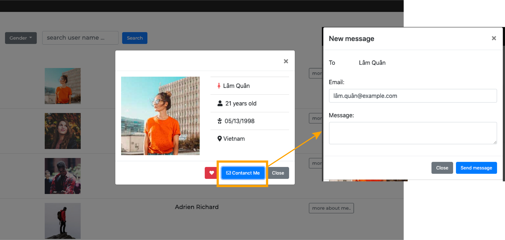
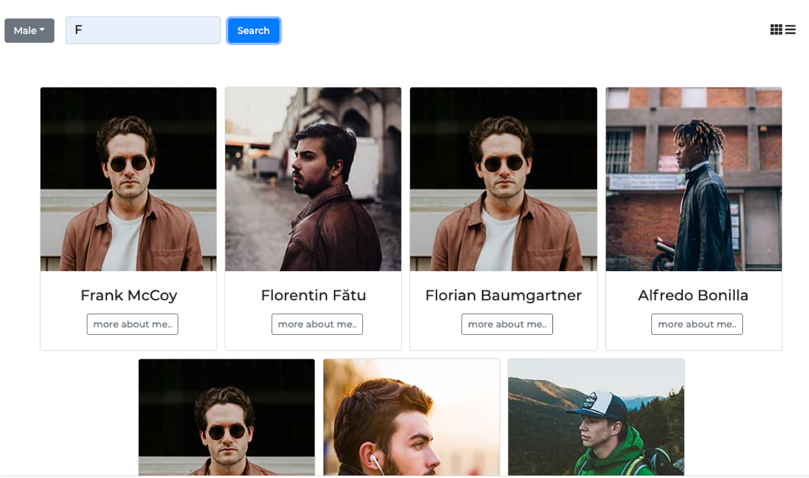

# UserList

A mockup social network website.data source is fetching from lighthouse API via axios.

User interface is created by boostrap and some pure-css to make it unique.

<a href="https://emily40830.github.io/userList/index.html">UserList</a>

  

## Feature
- ### User Card

  

  - Show the user vision (ex: photo, name) to let others get the first look
  - If you want to know more about any user, click the "more about me.." to find the profile in detail
  - In the profile of each user, you could directly contact them via their email or add them to the favorite list
- ### Favorite List
 - When you add anyone to favorite, the user will show in this page
 - The web UI and any function would the same as Home.
 - The favorite user profile will save in and remove from localStorage
- ### Filter

  

 - You could just find the spicific user by their name or gender

- ### Display Mode

  

 - You could transform the display mode to card view or list view
- ### Pagenation
 - Show maximum 15 users per page

 

